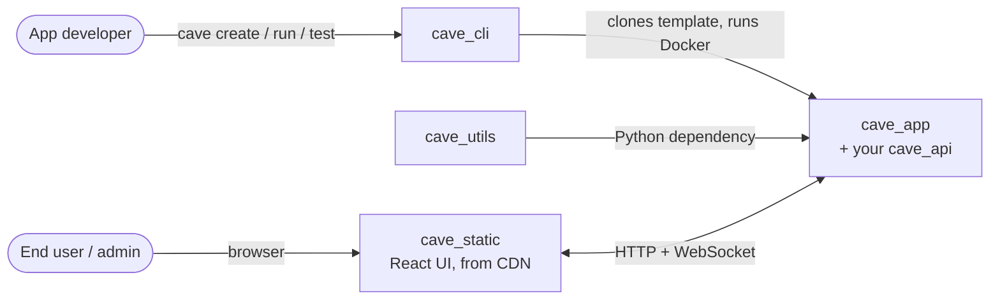
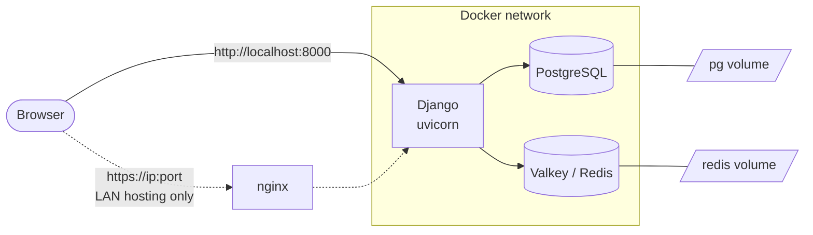
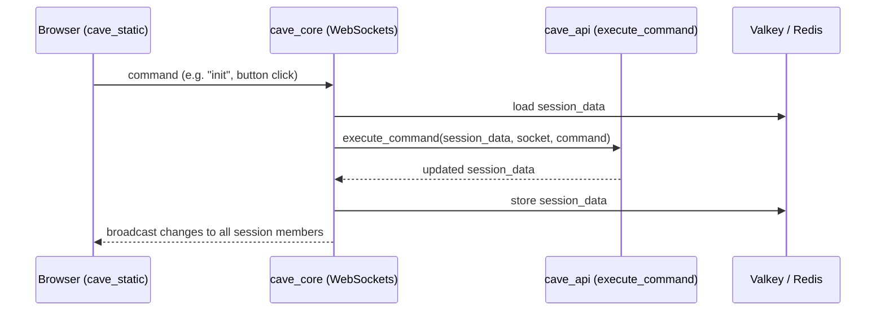

# CAVE App — Architecture Overview

This page gives a high level view of a CAVE app: what it offers to its users, the projects it depends on, how it is deployed, and how its code is organized. It is intended for app developers first, and for anyone deploying or evaluating a CAVE app.

---

## Capabilities

What a CAVE app lets each type of user do, and which part of the stack provides it. `session_data` keys (`maps`, `panes`, ...) are documented in the [API Spec](https://mit-cave.github.io/cave_utils/cave_utils/api.html).

| Domain | Capability | Actor | Provided by |
|---|---|---|---|
| **Interactive analysis** | Explore data on interactive maps | End user | `cave_static` + `cave_api` (`maps`, `mapFeatures`) |
| | View charts, tables, and KPIs | End user | `cave_static` + `cave_api` (`groupedOutputs`, `globalOutputs`) |
| | Set model inputs and run commands | End user | `cave_static` + `cave_api` (`panes`, `appBar`, `execute_command`) |
| **Collaboration** | Share a synchronized session across windows and users | End user | `cave_core` (WebSockets, sessions) + Valkey / Redis |
| **Administration** | Manage accounts, access, groups, and teams | Admin | `cave_core` (models, Django admin at `/cave/admin`) |
| | Create and edit site content pages | Admin | `cave_core` (pages) |
| **Development** | Expose a Python model as a web app, without frontend or backend code | App developer | `cave_api` (`execute_command`) + `cave_utils` |
| | Create, run, and test apps locally | App developer | `cave_cli` |

---

## Ecosystem

| Project | What it is | Deployed? |
|---|---|---|
| **cave_app** | This repository: the Django server, admin interface, and the `cave_api` folder where your app logic lives. Used as a template for every new app. | Yes |
| **cave_static** | A static React build that browsers load to render the app UI. Hosted on a CDN. | Loaded by the browser |
| **cave_utils** | A Python package with validation, logging, and builder utilities. Installed via `pyproject.toml`. | Yes (as a dependency) |
| **cave_cli** | The command-line tool used to create, run, test, and manage apps during development. | No |

---

## Deployment

Each app runs as a set of Docker containers on a dedicated network. `cave run` starts them for you (see the [Cave CLI](https://github.com/MIT-CAVE/cave_cli)); see [NON_CLI_README.md](NON_CLI_README.md) to run them manually or in production.

| Container | Image | Purpose |
|---|---|---|
| `<app>_django` | built from this `Dockerfile` | Django server (ASGI, via uvicorn), serving HTTP and WebSocket traffic |
| `<app>_db_host` | `postgres` | Database: users, groups, teams, site content, sessions |
| `<app>_redis_host` | `valkey/valkey` | Cache for session data and message broker for WebSocket broadcasts |
| `<app>_nginx_host` | `nginx` | Optional HTTPS reverse proxy, used for LAN hosting |

---

## Components and Data Flow

| Folder | Role | Who touches it |
|---|---|---|
| `cave_api/` | Your app logic, exposed through `execute_command` | You, almost always |
| `cave_core/` | Django app: models, auth, views, WebSocket session logic | Rarely |
| `cave_app/` | Django project: settings, ASGI, URL routing | Rarely |

See [DEVELOPMENT.md](DEVELOPMENT.md) for the full project structure.

When a user interacts with the UI, the request goes through the WebSocket layer to your `execute_command` function, and the returned `session_data` is broadcast back to every window and user in the same session:

See [API_README.md](API_README.md) for details on `execute_command`.
