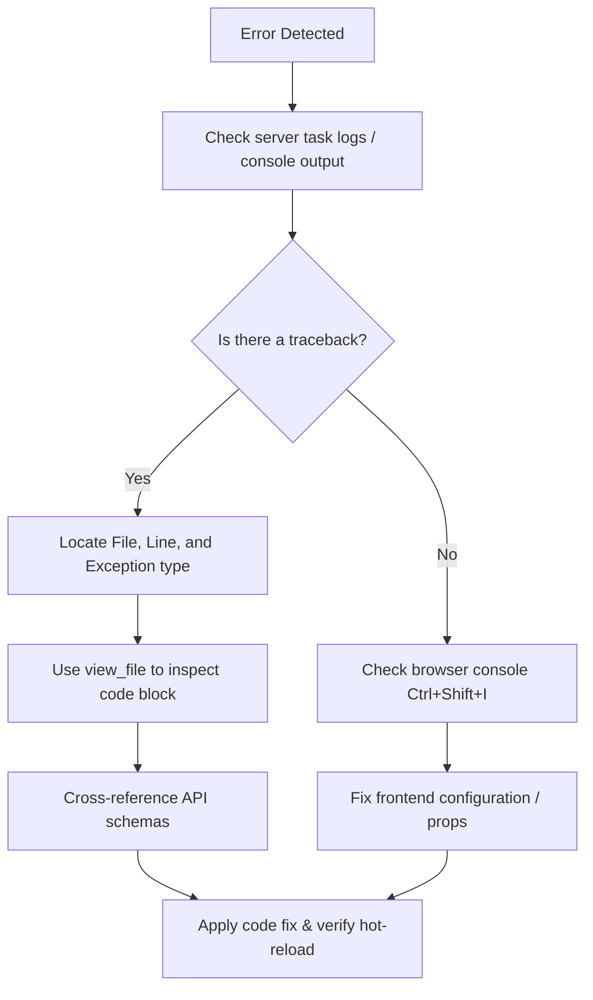

# Debugging and Error Resolution

This skill covers tracing, detecting, and resolving all types of errors (schema validation failures, live backend exceptions, database sync issues, and browser console errors) in CAVE.

---

## 1. Quick Debugging Reference

| Tool | How |
|---|---|
| **Print statements** | Add `print(...)` in `cave_api/` — output appears in the `cave run` terminal (hot-reloads, no restart needed). |
| **Raw logs** | Start the app with `cave run --all` (or `cave run -v`) to disable the TUI dashboard and print raw stdout/stderr directly (useful for full tracebacks). |
| **Manual validation** | `cave test init.py` — runs `Validator` against your `init` output and prints structured logs. |
| **Live validation** | Set `LIVE_API_VALIDATION_PRINT=true` in `.env`, then restart with `cave run` to see real-time updates. |
| **Browser console** | `Ctrl+Shift+i` → Console tab — a grey/blank screen after `init` usually means a frontend error here, not a Python exception. |

---

## 2. Detecting Live Server Errors

When the CAVE application encounters an issue at runtime (e.g., when a user interacts with a widget or triggers an action), errors are logged directly to the server logs.

### Checking Background Logs
If the server is running in the background as a task:
1. Locate the active task's log file in your agent's runtime data directory. This will be OS and agent-specific. To keep track of the log file, you may opt to pipe the logs to some project specific log file and investigate it from there. 
2. Read the tail of the log file using `view_file` to find the **Errors** block:
   ```text
   Errors  (1 error)
   ────────────────────────────────────────────────────────────────────────────
   14:18:49          session_data=session_data, command=command, socket=socket…
   14:18:49      )
   14:18:49    File "/app/cave_api/examples/selector/example_selector.py", lin…
   14:18:49      session_data = example_execute_command(session_data, socket, …
   14:18:49    File "/app/cave_api/examples/kitchen_sink.py", line 2390, in ex…
   14:18:49      raise Exception("Test Exception!")
   14:18:49  Exception: Test Exception!
   ────────────────────────────────────────────────────────────────────────────
   ```

### Running with Raw Logs (`cave run --all`)
If background task logs are truncated or hard to read, stop any running containers and launch CAVE in raw log mode:
```bash
cave run --all
```

#### Key Details:
* **Bypasses TUI Dashboard**: By default, `cave run` starts a terminal dashboard (TUI) summarizing container status. `--all` disables it, printing logs directly.
* **Complete Tracebacks**: The dashboard TUI limits vertical space and truncates stack traces. `--all` outputs complete, scrollable python tracebacks, container builds, and django startup messages.
* **Live Reload Monitoring**: Real-time output allows you to see exactly when Python files are modified and the Django development server hot-reloads.

> [!NOTE]
> Since `--all` streams stdout/stderr from all containers (app, database, cache) simultaneously, the output may interleave. To terminate the server, press `Ctrl+C` in the running terminal, or run `cave kill` in another terminal.

---


## 3. Step-by-Step Resolution Workflow



1. **Isolate the Error**:
   - Determine if the error is a **backend exception** (shown in python stack traces), a **schema validation error** (shown in `Validator` reports), or a **frontend crash** (blank screen, check browser dev tools console).
2. **Locate the Problematic Code**:
   - Find the file and line number at the bottom of the Python traceback (e.g., in [kitchen_sink.py](../../cave_api/examples/kitchen_sink.py)).
   - Match the active `command` passed to `execute_command`.
3. **Verify Schemas**:
   - Run `cave test init.py` (see [test](../test/SKILL.md)) to make sure your baseline structure validates successfully.
   - For real-time updates, verify that your changes conform to the correct property formats in the [api-reference](../api-reference/SKILL.md) skill.
4. **Fix and Validate**:
   - Edit the code. CAVE's server automatically hot-reloads Python changes, so you do not need to reboot the containers to verify most fixes.

---

## 4. Common Errors and Solutions

| Error Sign / Message | Probable Cause | How to Fix |
|---|---|---|
| `Exception: Test Exception!` | Pressed the simulated "Outlined Button Example" | None. This is a built-in demo error triggered from [kitchen_sink.py](../../cave_api/examples/kitchen_sink.py). |
| `KeyError: '...'` | Accessing a missing key in `session_data` (e.g. `session_data['panes']['data']`) | Check if the key exists using `.get()` or verify the initial structure in `init.py`. |
| `AttributeError: 'NoneType' object has no attribute '...'` | Expecting an object but got `None` | Add safety checks (`if obj is not None:`) before reading properties. |
| Page loads with blank/grey screen | Frontend JavaScript runtime crash | Open Chrome DevTools (`Ctrl+Shift+I`) → **Console** tab. Identify the React/JS error (often caused by invalid nested layout values or missing required props). Refer to the [layout-design](../layout-design/SKILL.md) skill. |
| DB connection or migrations stuck | Postgres container sync issues | Run `cave reset` (Note: this is destructive and resets the DB state). |


## 5. Proactive Debugging and Surfacing Bugs

To detect hidden issues early or assist in tracing unknown bugs during development, use these programmatic techniques in your `cave_api/` handlers:

### A. Defensive Coding & Context-Rich Exceptions
Avoid allowing the app to fail silently or crash with generic `NoneType` or `KeyError` messages downstream. Raise descriptive exceptions that capture the current state:
```python
# Verify critical state assumptions
if "my_key" not in session_data:
    raise KeyError(
        f"Missing critical key 'my_key' in session_data. "
        f"Current keys: {list(session_data.keys())}"
    )
```

### B. Inline Validation Checks
If your command handler performs complex modifications to `session_data`, validate the result programmatically before returning it to the client:
```python
from cave_utils import Validator

# Perform session modifications
# ...

# Run localized validation
validator = Validator(session_data, ignore_keys=["meta"])
if len(validator.log.log) > 0:
    # Option 1: Print validation issues immediately to server logs
    validator.log.print_logs()
    
    # Option 2: Notify the user/developer via a UI toast without crashing the backend
    socket.notify(
        message="A schema mismatch was detected in the session update. Check server logs.",
        title="Schema Warning",
        theme="warning"
    )
```

### C. Live Logging and State Inspection
Leverage hot-reloading by adding temporary debug prints. To trace execution flow and see parameters sent by the frontend:
```python
print(f"DEBUG: execute_command triggered with command={command}")
print(f"DEBUG: Current session keys: {list(session_data.keys())}")
```
These prints will immediately output to the active server terminal (best viewed via `cave run --all`).

### D. Mutation Log Capture
If a bug only triggers after a specific sequence of user clicks:
1. Capture the frontend mutation sequence logs under `tests/mutation_logs/`.
2. Write a regression test in `tests/replay.py` to replay this exact sequence programmatically. Refer to the [add-test](../add-test/SKILL.md) skill.

---


## See Also
- [test](../test/SKILL.md) — For running automated validation tests.
- [data-validation](../data-validation/SKILL.md) — For validator logs and live schema print setups.
